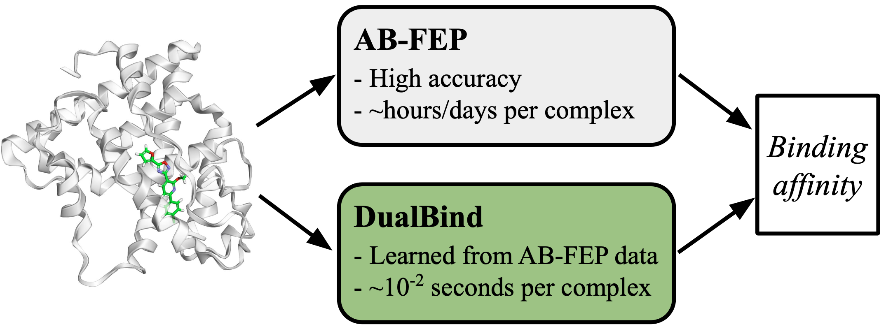

# DualBind and ToxBench
[Paper (ICML 2025 GenBio Workshop)](https://arxiv.org/abs/2507.08966) | [ToxBench Dataset](https://huggingface.co/datasets/karlleswing/toxbench)

This repository contains the PyTorch implementation of **DualBind**, a 3D structure-based deep learning model with a dual-loss framework for accurate and fast protein-ligand binding affinity prediction, along with scripts to benchmark DualBind on the **ToxBench** AB-FEP dataset.

<p align="center">

</p>


## Setup

Clone this repo and then use `env.sh` to create the conda environment.
```bash
bash env.sh
conda activate dualbind
```

## ToxBench Dataset
ToxBench is the first large-scale AB-FEP dataset designed for ML development and focused on a single pharmaceutically critical target, Human Estrogen Receptor Alpha (ERα). ToxBench provides 8,770 ERα-ligand complexes with AB-FEP caculated binding free energies. The dataset includes:

- Protein-ligand structures in PDB and SDF format.
- Binding affinities computed via AB-FEP in CSV format.
- Predefined training/validation/test splits to ensure robust model evaluation.

More details about the ToxBench dataset can be found in [our paper](https://arxiv.org/abs/2507.08966). The full dataset is publicly available on [Hugging Face](https://huggingface.co/datasets/karlleswing/toxbench).


## DualBind on ToxBench
DualBind integrates supervised mean squared error (MSE) with unsupervised denoising score matching (DSM) to effectively learn the protein-ligand binding energy function.
<p align="center">

</p>


### Train DualBind on ToxBench

1. Download the ToxBench dataset
2. Configure training parameters in `conf/train_toxbench.yaml`
3. Run training:
```bash
python train_toxbench.py
```

### Inference on ToxBench
You can use our ToxBench-trained DualBind checkpoint (available [here (coming soon)](https://github.com/NVIDIA-Digital-Bio/dualbind)) for inference.

1. Download the DualBind checkpoint
2. Configure inference parameters in `conf/inference_toxbench.yaml`, especially for protein_files and ligand_files
3. Run inference:
```bash
cd DualBind
python inference_toxbench.py
```
The results will be saved in a CSV file containing predicted binding affinities.


## Citation

If you use DualBind or ToxBench in your research, please cite:

```latex
@inproceedings{
liu2025toxbench,
title={{ToxBench}: A Binding Affinity Prediction Benchmark with {AB}-{FEP}-Calculated Labels for Human Estrogen Receptor Alpha},
author={Meng Liu and Karl Leswing and Simon K.S. Chu and Farha Ramezanghorbani and Griffin Young and Gabriel Marques and Prerna Das and Anjali Panikar and Esther Jamir and Mohammed Sulaiman Shamsudeen and K. Shawn Watts and Ananya Sen and Hari Priya Devannagari and Edward B. Miller and Muyun Lihan and Howook Hwang and Janet Paulsen and Xin Yu and Kyle Gion and Timur Rvachov and Emine Kucukbenli and Saee Gopal Paliwal},
booktitle={ICML 2025 Generative AI and Biology (GenBio) Workshop},
year={2025},
url={https://openreview.net/forum?id=5lpHuVsE94}
}
```

## License

The DualBind source code and checkpoint are released under an NVIDIA license for non-commercial or research purposes only. Please refer to the LICENSE file for details. 

